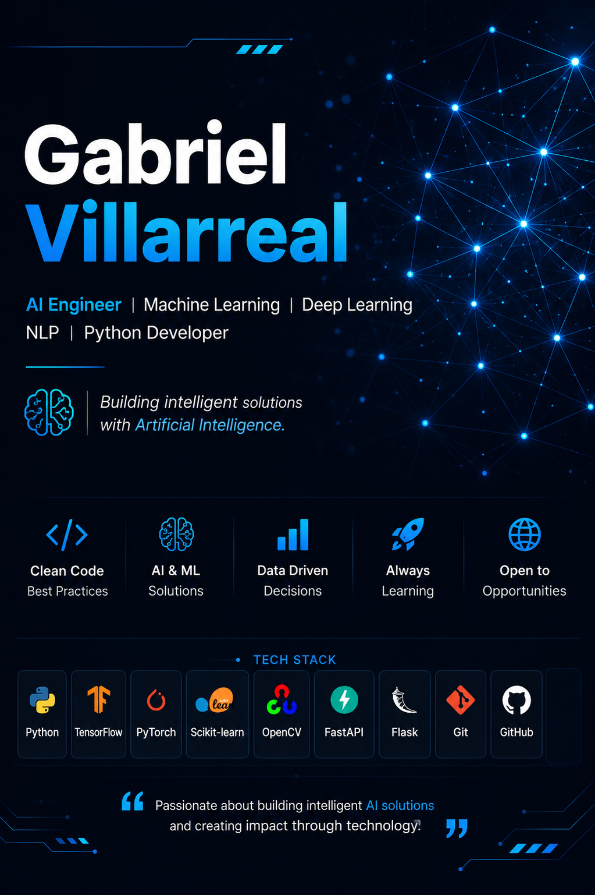

  

<h1 align="center">Gabriel Villarreal</h1>
<h3 align="center">Artificial Intelligence Engineer</h3>
<h3 align="center">
AI Engineer • Machine Learning • Deep Learning • NLP • Python Developer
</h3>

Computer Science Engineer with Honors from Universidad Politécnica Estatal del Carchi (UPEC). Computer Science Engineer with Honors from UPEC, focused on Artificial Intelligence, Machine Learning, Deep Learning, Natural Language Processing and Python development. Passionate about building intelligent solutions with real-world impact.

---

## 🚀 About Me

- 🎓 Computer Science Engineer (UPEC)
- 🧠 Specialized in Artificial Intelligence
- 🤖 Machine Learning & Deep Learning
- 💬 Natural Language Processing (NLP)
- 🐍 Python Developer
- 🌍 Open to AI, Machine Learning and Software Engineering opportunities worldwide.
- 📚 Currently expanding my knowledge in AI and Software Engineering

---

## 🛠 Tech Stack

---

## 🎓 Education

🎓 B.Sc. in Computer Science (2026)
Universidad Politécnica Estatal del Carchi (UPEC)
Graduated with Honors
---

## 📫 Contact

- 📧 Email: gabrielvillarreal2000@gmail.com
- 💼 LinkedIn: https://www.linkedin.com/in/gabriel-villarreal
- 🌐 Portfolio: Under Development
